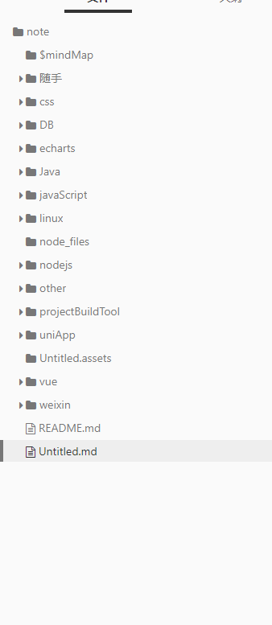

# mysql 安装教程

## mysql 下载链接

<https://www.mysql.com/downloads/>

解压至 C:\web\mysql-8.0.11  在该文件夹下创建 my.ini 配置文件，编辑 my.ini 配置以下基本信息：

```shell

[mysqld]
# 设置3306端口
port = 3306
# 设置mysql的安装目录
basedir=C:\\web\\mysql-8.0.11
# 设置 mysql数据库的数据的存放目录，MySQL 8+ 不需要以下配置，系统自己生成即可，否则有可能报错
# datadir=C:\\web\\sqldata
# 允许最大连接数
max_connections=20
# 服务端使用的字符集默认为8比特编码的latin1字符集
character-set-server=utf8
# 创建新表时将使用的默认存储引擎
default-storage-engine=INNODB

```

以管理员身份打开 cmd 命令行工具，切换目录：

> cd C:\web\mysql-8.0.11\bin
初始化数据库：

> mysqld --initialize --console

执行完成后，会输出 root 用户的初始默认密码，如：

```
...
2018-04-20T02:35:05.464644Z 5 [Note] [MY-010454] [Server] A temporary password is generated for root@localhost: APWCY5ws&hjQ
...
```

ykUwoXRQ84_w

启动输入以下命令即可：

net start mysql
注意: 在 5.7 需要初始化 data 目录：

cd C:\web\mysql-8.0.11\bin 
mysqld --initialize-insecure 

> mysqld install

 1%DJ;xepolXO

 ## 修改密码

> mysql -u root -p
 > alter user user() identified by "123456";


