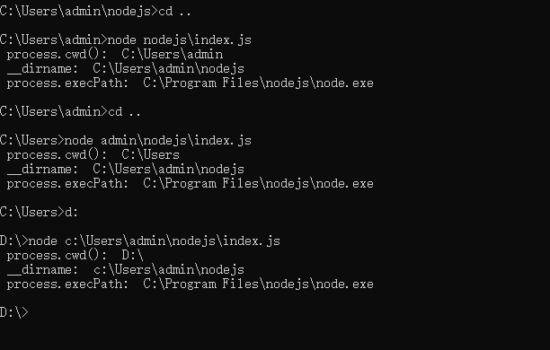

# nodejs获取启动命令路径、文件路径、node.exe路径

-  **process.cwd()**   执行命令时所在的目录
- **__dirname**  该js脚本所在的目录
- **process.execPath** 执行此js脚本所用的nodejs程序文件路径

例子 ：

在 `C:\Users\admin\nodejs>`下创建 `index.js`

```js
//  index.js
console.log(' process.cwd(): ', process.cwd()) // 执行命令时所在的目录
console.log(' __dirname: ', __dirname)   // 该index.js所在的目录
console.log(' process.execPath: ', process.execPath)	// nodejs
```

执行js脚本：

