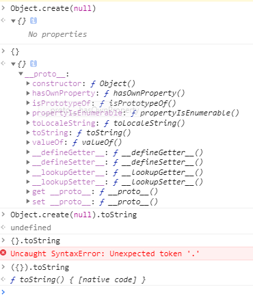

#  20191021 - 20191027 周学习笔记

## 10.21

- `Object.keys(obj: Object):Array ` 遍历一个对象，返回一个对象key值的数组，和 for..in的区别是不会遍历原型链上的属性

- `Object.defineProperty(target: any, prop:string | numbe | symbol, attributes)`

  ```js
  arrtibuts: {
      configurable:bolean = false, // 当且仅当该属性的 configurable 为 true 时，该属性描述符才能够被改变，同时该属性也能从对应的对象上被删除
      enumerable:bolean = false, // 当且仅当该属性的enumerable为true时，该属性才能够出现在对象的枚举属性中
      value:any = undefined, //该属性对应的值。可以是任何有效的 JavaScript 值（数值，对象，函数等）
  	writable: bolean = false, // 当且仅当该属性的writable为true时，value才能被赋值运算符改变
      get:function = undefined,
      set: function = undefined, 
  },
  // 如果一个描述符同时有(value或writable)和(get或set)关键字，将会产生一个异常。
  ```

  

## 10.22

- `Object.prototype.hasOwnProperty(key:  string): bollean` : 这个方法会查找一个对象是否有某个属性，但是不会去查找它的原型链 

```js
const hasOwnProperty = Object.prototype.hasOwnProperty
export function hasOwn (obj: Object | Array<*>, key: string): boolean {
  return hasOwnProperty.call(obj, key)
}
```

- 检查对象是否为原生JavaScript对象

```js
const _toString = Object.prototype.toString
function isPlainObject(obj: any): boolean {
return _toString.call(obj) === '[Object Object]'
}
```

 ## 10.23

vue的生命周期

`beforeCreate` 现在还不能拿到data里的数据，`this.message ==> nudefined`，可以拿到 `this.$el`

```javascript
vm._self = vm
initLifecycle(vm) // 初始化生命周期，全部设置为 null
initEvents(vm)
initRender(vm)
callHook(vm, 'beforeCreate') // callHook 挂载 beforeCreate
```

## 组件间的传值方式

### $attrs和$listeners

**$attrs**

`<div v-bind="$attrs"></div>` 

`$attrs`是除了props中的**属性**，父组件中传递过来的所有**属性**（style和class除外）

> 相当于$attrs = 父组件传递过来的属性 - style -class - 子组件自身定义的属性

**$listeners**

可以获取到父组件间传递过来的所有**事件**

 `<div v-on="$listeners"></div>`

例如：现在在一个系统中，用了很多echarts（vue-echarts）的图表，现在是我想在系统中切换主题的时候，把echarts的主题都切换，我们可以这样在vuex中保存echarts的主题，在具体的页面中用 computed 来得到echarts的主题

```js
<v-chart :theme="echartsTheme"></v-chart>
...
computed: {
    echartsTheme() {
    	return this.$store.state.echartsTheme
    }
}
```

但我页面很多，好去写很多这样的代码，代码的冗余度很高

接下来我们就来封装一个组件

```html
<template>
  <v-chart :theme="echartsTheme" v-bind="$attrs" v-on="$listeners"></v-chart>
</template>
<script>
export default {
  name: 'zf-chart',
  props: {
    theme: {
      type: String,
      default: ''
    }
  },
  computed: {
    echartsTheme() { // 当父组件传递的有 theme 时就为传递 theme
      return this.theme || this.$store.state.echartsTheme
    }
  }
}
</script>

```

现在我们只需要全局的把 v-cahrt 替换成 zf-chart 就可以

```html
 <zf-chart class="car__chart"  @click="handleClick" :options="options"></zf-chart>
```

### provide和inject

 2.2.0 新增  以允许一个祖先组件向其所有子孙后代注入一个依赖，不论组件层次有多深，并在起上下游关系成立的时间里始终生效。 

```js
//父组件:
provide: { //provide 是一个对象,提供一个属性或方法
  foo: '这是 foo',
  fooMethod:()=>{
    console.log('父组件 fooMethod 被调用')
  }
},

// 子或者孙子组件
inject: ['foo','fooMethod'], //数组或者对象,注入到子组件
mounted() {
  this.fooMethod()
  console.log(this.foo)
}
//在父组件下面所有的子组件都可以利用inject

```

 provide 和 inject 绑定并不是可响应的。这是官方刻意为之的。 然而，如果你传入了一个可监听的对象，那么其对象的属性还是可响应的,对象是因为是引用类型 

```js
//父组件:
provide: { 
  foo: '这是 foo'
},
mounted(){
  this.foo='这是新的 foo'
}

// 子或者孙子组件
inject: ['foo'], 
mounted() {
  console.log(this.foo) //子组件打印的还是'这是 foo'
}

```

### Vue.observable

2.6.0 新增 用法:让一个对象可响应。Vue 内部会用它来处理 data 函数返回的对象; 返回的对象可以直接用于渲染函数和计算属性内，并且会在发生改变时触发相应的更新; 也可以作为最小化的跨组件状态存储器，用于简单的场景。 通讯原理实质上是利用Vue.observable实现一个简易的 vuex

```html
// 文件路径 - /store/store.js
import Vue from 'vue'

export const store = Vue.observable({ count: 0 })
export const mutations = {
  setCount (count) {
    store.count = count
  }
}

//使用
<template>
    <div>
        <label for="bookNum">数 量</label>
            <button @click="setCount(count+1)">+</button>
            <span>{{count}}</span>
            <button @click="setCount(count-1)">-</button>
    </div>
</template>

<script>
import { store, mutations } from '../store/store' // Vue2.6新增API Observable

export default {
  name: 'Add',
  computed: {
    count () {
      return store.count
    }
  },
  methods: {
    setCount: mutations.setCount
  }
}
</script>
```

### Vue 动态组件

```html
<component :is="currentComponent"></component>
```

---

- Vue.prototype.$next： 再下次DOM更新循环结束之后延迟的回调， 在修改数据之后立即使用这个方法，获取更新后的 DOM 


- vue 中 可以直接访问 props、data、computed里的内容

  ```js
  function proxy (target: Object, sourceKey: string, key: string) {
    sharedPropertyDefinition.get = function proxyGetter () {
      return this[sourceKey][key]
    }
    sharedPropertyDefinition.set = function proxySetter (val) {
      this[sourceKey][key] = val
    }
    Object.defineProperty(target, key, sharedPropertyDefinition)
  }
  
  proxy(this, '_data', datakey)
  proxy(this, '_props', propsKey)
  ```

  

- methods 是通过

  ```js
  vm[key] = typeof methods[key] !== 'function' ? noop : bind(methods[key], vm)
  ```

- vue 中的 `/deep/` 

  ```CSS
  <style scoped>
  .wrap .box image { } /*渲染之后是这样的 .wrap .box image[data-v-xxxx] */
  .wrap /deep/ .box image {} /* 渲染之后是这样的 .wrap[data-v-xxxx] .box image */
  </style>
  ```

  


## 10.24

`Object.create(null)` 创建的对象和 `{}` 的区别是  `Object.create(null)`没有继承任何原型方法，也就是说它的原型链没有上一层。


## 10.25 

Vue组件的继承

```js
const ParentComponent = {
    props: {
        
    },
    data() {
        return {
            a: ''
        }
    },
    methods: {
        // ...
	}
}

const SonComponent = {
    extends: ParentComponent,
    propsData: { // props要重写为 propsData
        
    }
}
```


