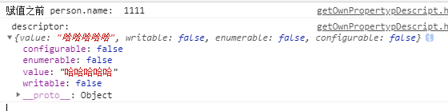
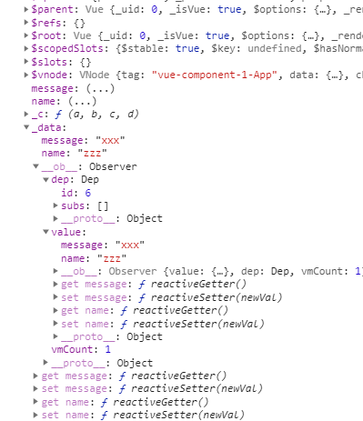

# 20191028 - 20191101 周学习笔记


## 10.28 

```js
Vue.prototype.$bus = new Vue()

// listen
this.$bus.$on('event-name', function(params) {})
// emit
this.$bus.$emit('event-name', params)
// off
this.$bus.$off('event-name')

```

## 10.30

-  **函数柯里化**   就是只传递给函数一部分参数来调用它，让它返回一个函数去处理剩下的参数。 

## 10.31

- `Object.getOwnProperDescript(obj:object, key: string | number):object`： 获取指定对象的自身属性描述符。自身属性描述符是指直接在对象上定义（而非从对象的原型继承）的描述符。

  - obj   包含属性的对象。 
  - key  属性的名称。 

  ```js
  <!DOCTYPE html>
  <html lang="en">
  <head>
    <meta charset="UTF-8">
    <title>getOwnPropertyDescriptor</title>
  </head>
  <body>
    <script type="text/javascript">
      var person = {};
      //结合Object.defineProperty方法来定义属性名，以及给值
      Object.defineProperty(person, "name", {
        value: "1111",
        configurable: false,
        writable: true
      });
      console.log('赋值之前 person.name: ', person.name)
      person.name = "哈哈哈哈哈"
      var descriptor = Object.getOwnPropertyDescriptor(person, "name");
      descriptor.writable = false
      console.log(' descriptor: ', descriptor)
    </script>
  </body>
  </html>
  ```

  

  

  

- Vue key 的作用，vue为了更快的去渲染元素，就会复用一些元素，没有key时会渲染快一点

- v-if与v-for合不来，  并不是说他俩一起出现在同一元素上就报错，就不好使，不是这样的。是因为v-for会比v-if拥有更高的优先级，会造成v-for白忙活一场。

- **函数防抖  debounce **

   函数防抖（debounce）：当持续触发事件时，一定时间段内没有再触发事件，事件处理函数才会执行一次，如果设定的时间到来之前，又一次触发了事件，就重新开始延时。如下图，持续触发scroll事件时，并不执行handle函数，当1000毫秒内没有触发scroll事件时，才会延时触发scroll事件 

  ***当持续触发scroll事件时，事件处理函数handle只在停止滚动1000毫秒之后才会调用一次，也就是说在持续触发scroll事件的过程中，事件处理函数handle一直没有执行。*** 

  ```js
  // 防抖 连续的事件周期结束时执行一次
  function debounce (cb, wait) {
      var timeout = null
      return function () {
          if (itemout !== null) clearTimeout(tiemout)
          timeout = setTimeout(cb, wait)
      }
  } 
  ```

  

  **函数节流  throttle ** 一定时间内只执行一次

  ```js
  // 节流
  function throttle (cb, delay) {
      var timer = null
      return function() {
          var context = this
          var args = arguments
          if (timer === null) {
           	timer = setTimeout(function() {
                  cb.apply(context, args)
                  timer = null
             }， delay)
          }
      }
  }
  ```

  
   


## 11.01


- new observer() 之后，会在vue的实例vm.\_data 就会有\__ob__属性，保存的是observer的实例，

- Vue的响应式数据都会有一个\__ob__的属性作为标记，里面存放了该属性的观察器，也就是Observer的实例，防止重复绑定。

  ```js
  // 现在这里的value是vm的data
  export function observe(value, asRootData) {
      // ..
      ob = new Observer(value)
      // ..
  }
  // Observer
  constructor(value) {
      this.value = value
      this.dep = new Dep()
      this.vmCount = 0
      def(value, '__ob__', this)
  }
  ```

  

  





